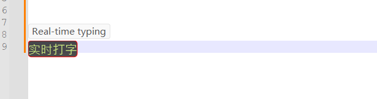

```
████████╗██╗   ██╗██████╗ ██╗███╗   ██╗ ██████╗     ████████╗██████╗  █████╗ ███╗   ██╗███████╗██╗      █████╗ ████████╗██╗ ██████╗ ███╗   ██╗
╚══██╔══╝╚██╗ ██╔╝██╔══██╗██║████╗  ██║██╔════╝     ╚══██╔══╝██╔══██╗██╔══██╗████╗  ██║██╔════╝██║     ██╔══██╗╚══██╔══╝██║██╔═══██╗████╗  ██║
   ██║    ╚████╔╝ ██████╔╝██║██╔██╗ ██║██║  ███╗       ██║   ██████╔╝███████║██╔██╗ ██║███████╗██║     ███████║   ██║   ██║██║   ██║██╔██╗ ██║
   ██║     ╚██╔╝  ██╔═══╝ ██║██║╚██╗██║██║   ██║       ██║   ██╔══██╗██╔══██║██║╚██╗██║╚════██║██║     ██╔══██║   ██║   ██║██║   ██║██║╚██╗██║
   ██║      ██║   ██║     ██║██║ ╚████║╚██████╔╝       ██║   ██║  ██║██║  ██║██║ ╚████║███████║███████╗██║  ██║   ██║   ██║╚██████╔╝██║ ╚████║
   ╚═╝      ╚═╝   ╚═╝     ╚═╝╚═╝  ╚═══╝ ╚═════╝        ╚═╝   ╚═╝  ╚═╝╚═╝  ╚═╝╚═╝  ╚═══╝╚══════╝╚══════╝╚═╝  ╚═╝   ╚═╝   ╚═╝ ╚═════╝ ╚═╝  ╚═══╝
```
# Real-time-translation-typing
  

  
## 快捷键
* ALT Y: 打开
* ALT ENTER:发音
* ENTER: 输出翻译文本
* CTRL ENTER: 输出原始文本
* ESC: 退出
* TAB: 切换另一个翻译API
* CTRL F7: 网页版调试
#### 网页版额外快捷键
* CTRL + C :复制结果
* CTRL + ALT + Y :翻译当前粘贴板
* CTRL + V:打开状态下，输入粘贴板内容

## 网页调用版本(推荐)
目前支持 搜狗、百度、有道
|环境|版本|
|-|-|
|系统|需要**win10**或者安装 **[webview2 runtime](https://msedge.sf.dl.delivery.mp.microsoft.com/filestreamingservice/files/3c9f7ac6-fb0a-4eb7-b1fd-44c57613a3f5/MicrosoftEdgeWebView2RuntimeInstallerX64.exe)**|
|源码运行需要 ahk 版本| [autohotkey v2H](https://github.com/thqby/AutoHotkey_H/releases)|

## API版本(不推荐)
通过配置文件来配置 `/config/setting.json`

* 选择主翻译API
```
    "cd" : "youdao"   ## 目前支持 "baidu", "google"(需要科学上网，且美国节点), "youdao", "sougou"
```
备选API需配置 `is_open` 为 1
如果没反应，可能api在维护，可以切换另一个使用
目前免费的是有道和搜狗和谷歌， 有道是直接调用的api速度比较快，搜狗是爬虫(速度较慢),谷歌需要翻墙
百度结果很不错，但是需要注册(免费100w字符/月)


* 有道词典
```
http://fanyi.youdao.com/translate?smartresult=dict&smartresult=rule&smartresult=ugc&sessionFrom=null
{
    "is_open" : 1
}
```

```
https://fanyi.sogou.com/text?keyword=%E4%BD%A0%E5%A5%BD&transfrom=auto&transto=en&model=general
    "sougou" :
    {
        "is_open" : 1,
        "is_real_time_translate" : 1
    },
```

* 谷歌
```
{
    "is_open" : 0,
    "is_real_time_translate" : 0
}
```

* 百度翻译
需要自己注册后，把key填到配置文件
http://api.fanyi.baidu.com/api/trans/product/index

```
{
    "is_open" : 0,
    "BaiduFanyiAPPID" : "xxxxx",
    "BaiduFanyiAPPSEC": "xxxxx",
    "is_real_time_translate" : 0
}
```
因为百度使用次数有限额，因此通过  `is_baidu_real_time_translate` 来配置是否实时触发翻译
当配置 `0` 时，需要输入 `空格` 键 主动翻译, 建议输入最后键入`空格`

* 切换

按 `tab`键，从配置和打开的API切换